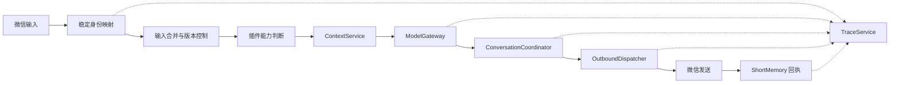

# 小悠 Xiaoyou v1.3

<p align="center">
  
</p>

> 基于个人微信、chatgpt-on-wechat、Qwen、阿里云百炼和火山方舟构建的长期陪伴型微信 AI。

小悠不是公众号机器人或企业微信客服。项目通过个人微信小号运行，目标是让她在日常聊天中拥有稳定人格、连续记忆、主动性、时间感、图片理解和生活表达，同时保持工程链路可追踪、可恢复、可维护。

当前版本不再由各插件分别请求模型、发送微信、写 JSON 和处理异常，而是建立了统一的模型、发送、状态、上下文、协调和 Trace 中枢。

## 当前状态

```text
版本：v1.3
基础镜像：zhayujie/chatgpt-on-wechat:1.7.3
微信通道：个人微信 wx / itchat
主聊天模型：qwen3.7-max
分类与摘要模型：qwen3.7-plus
视觉模型：qwen3.7-max-2026-06-08
图片生成：doubao-seedream-5-0-lite-260128
部署方式：Docker Compose
```

## 核心能力

- 个人微信文字聊天与自然多气泡回复
- 稳定人格与现实时间感知
- 连续短消息合并，新输入自动废弃旧回复
- 阿里云百炼长期记忆
- 带主备份、摘要和隔离机制的短期记忆
- 图片理解与“图片 + 后续补话”联合处理
- 主动联系、断聊追问、提醒和模型中断重连
- 搜索、天气、地点和路线 MCP 工具
- 小悠生活照规划、人物一致性参考和主动分享
- 稳定身份映射，微信临时 UserName 变化后仍使用固定会话 `yoyo`
- 不记录正文和密钥的全链路 Trace

## 六个统一中枢

### ModelGateway

路径：`plugins/xiaoyou_common/model_gateway.py`

统一 OpenAI 兼容模型调用、模型和密钥解析、thinking 参数兼容、超时、异常分类、内容审查识别及 `model_call_id` Trace。能力插件只负责业务决策，不再各自实现 HTTP 请求。

### OutboundDispatcher

路径：`plugins/xiaoyou_common/outbound_dispatcher.py`

统一微信文字和图片发送，包括稳定收件人解析、同会话串行发送、输入版本检查、多气泡延迟、中途取消、发送回执以及 ShortMemory 写回。

### JsonStateStore

路径：`plugins/xiaoyou_common/state_store.py`

统一本地 JSON 的主文件/备份、临时文件原子替换、`flush + fsync`、最后良好状态恢复，以及损坏时禁止用空状态覆盖。

### ConversationCoordinator

路径：`plugins/xiaoyou_common/conversation_coordinator.py`

统一自主动作竞争与抢占：

```text
Reminder     100
Reconnect     90
Followup      70
Proactive     40
```

高优先级动作可以抢占低优先级动作；用户新输入会取消旧动作；发送前再次检查租约。

### ContextService

路径：`plugins/xiaoyou_common/context_service.py`

统一读取 `CHARACTER_DESC`、现实时间、最近真实聊天原话、ShortMemory 和 AliyunMemory，减少各能力之间的人格和时间认知差异。

### TraceService

路径：`plugins/xiaoyou_common/trace_service.py`

```text
trace_id
→ input_id
→ model_call_id
→ lease_id
→ action_id
→ memory_record_id
```

Trace 只记录组件、状态、耗时、错误分类和匿名化 ID，不记录提示词、聊天正文、图片内容或密钥。

## 消息链路



## 人格与记忆

### 人格来源

核心人格来自 `docker-compose.yml` 中的 `CHARACTER_DESC`。

`plugins/xiaoyou_life_photo/assets/xiaoyou_body_profile.json` 只服务于生活照人物一致性，不参与普通文字聊天，也不会覆盖核心人格。

### 短期记忆

插件：`plugins/short_memory`

```text
plugins/short_memory/short_memory.json
plugins/short_memory/short_memory.json.backup
```

当前使用 schema v2，包含 UUID、source、最近原话、异步摘要、待归档消息、内容审查隔离以及主备份容灾。审查失败记录会保留，但不会继续注入模型上下文。

### 长期记忆

插件：`plugins/aliyun_memory`

长期记忆存储在阿里云百炼记忆服务，不在本地 JSON 中。读取时会结合语义相关度、明确时间表达和近期时间权重排序。

```env
ALIYUN_MEMORY_LIBRARY_ID=your_bailian_memory_library_id_here
```

### 稳定身份

插件：`plugins/xiaoyou_identity`

内部会话固定使用 `yoyo`，微信登录期产生的 `@...` UserName 只作为临时收件人。插件可以通过 Alias、备注名、昵称或旧 UserName 学习当前联系人，并把历史状态迁移到稳定会话。

单用户部署建议保持：

```yaml
XIAOYOU_IDENTITY_PRUNE_SHORT_MEMORY: 'true'
```

多人部署必须设为 `false`，并重新设计会话、记忆和收件人隔离。

## 插件

| 插件 | 作用 | 优先级 |
|---|---|---:|
| XiaoyouIdentity | 稳定身份和收件人映射 | 10000 |
| PatPatReply | 拍一拍自然回应 | 9999 |
| ConversationFollowup | 聊天中断后的自然追问 | 9998 |
| AliyunMemory | 长期记忆读取与写入 | 900 |
| SplitReply | 微信语义分段和延迟发送 | 99 |
| QwenVision | 图片理解与补充文字合并 | 80 |
| ShortMemory | 短期原话、摘要和隔离 | 40 |
| ReminderLove | 提醒识别、触发和后续衔接 | 35 |
| XiaoyouLifePhoto | 生活照规划、生成和主动分享 | 31 |
| XiaoyouMCP | 搜索、天气、地点和路线 | 30 |
| ProactiveLove | 长周期主动联系 | 10 |
| XiaoyouChat | 主聊天与模型中断重连 | -10000 |

插件启用状态与顺序位于 `plugins/plugins.json`。

## 主要功能

### 连续输入合并

用户短时间连续发送多条消息时，`patches/chat_channel.py` 会等待输入稳定并合并为同一轮。模型思考期间如果出现新输入，旧回复会在装饰或发送前被废弃。

### 模型中断重连

模型因上下文截断或临时错误未能完成回复时，`XiaoyouChat` 会受控重试，并通过 Coordinator 避免与提醒、追问冲突。

### 图片理解

`QwenVision` 会等待图片后的补充文字，把多条补话合并后再理解，默认输出自然反应而不是识别报告。

### 生活照

`XiaoyouLifePhoto` 使用 Qwen 结合人格、时间和记忆规划画面，再通过 Seedream 生成人物一致的生活照。参考图和身体设定只影响图片生成。

### 主动行为

- `ConversationFollowup`：几分钟级断聊追问
- `ProactiveLove`：长周期生活感主动联系
- `ReminderLove`：用户明确要求的提醒
- `XiaoyouChat`：模型异常后的重连接话

是否主动说、说什么由模型决定；工程层只负责频率、免打扰、目标会话、优先级和安全发送。

## 项目结构

```text
cow-legacy/
├─ assets/
├─ data/                         # 登录状态与运行数据，不提交
├─ patches/
│  ├─ chat_channel.py
│  ├─ chat_gpt_bot.py
│  └─ patch_app_imports.py
├─ plugins/
│  ├─ aliyun_memory/
│  ├─ conversation_followup/
│  ├─ patpat_reply/
│  ├─ proactive_love/
│  ├─ qwen_vision/
│  ├─ reminder_love/
│  ├─ short_memory/
│  ├─ split_reply/
│  ├─ xiaoyou_chat/
│  ├─ xiaoyou_common/            # 六个统一中枢
│  ├─ xiaoyou_identity/
│  ├─ xiaoyou_life_photo/
│  └─ xiaoyou_mcp/
├─ .env.example
├─ Dockerfile
└─ docker-compose.yml
```

## 部署

### 1. 克隆与配置

```bash
git clone https://github.com/yan-gd/xiaoyou.git
cd xiaoyou
cp .env.example .env
```

至少配置：

```env
KEY=your_bailian_api_key_here
SEEDREAM_KEY=your_volcengine_ark_api_key_here
ALIYUN_MEMORY_LIBRARY_ID=your_bailian_memory_library_id_here
```

稳定身份可以配置一个或多个锚点：

```env
XIAOYOU_LEGACY_SESSION_IDS=
XIAOYOU_TARGET_WECHAT_ALIAS=
XIAOYOU_TARGET_REMARK_NAME=
XIAOYOU_TARGET_NICKNAME=
```

### 2. 构建与启动

```bash
docker build -t cow-legacy-local:vision-no-think .
docker compose up -d
docker logs -f cow-legacy
```

根据日志扫码登录个人微信小号。

### 3. 更新

先备份服务器的 `.env`、`data/` 和插件运行态 JSON，再执行：

```bash
git pull --ff-only
docker build -t cow-legacy-local:vision-no-think .
docker compose up -d --force-recreate
```

不要用仓库中的空文件覆盖服务器真实记忆和状态文件。

## 常用命令

```bash
docker ps --filter name=cow-legacy
docker logs -f cow-legacy
docker compose restart
docker compose config
```

重新构建：

```bash
docker build --no-cache -t cow-legacy-local:vision-no-think .
docker compose up -d --force-recreate
```

## 运行态数据

以下内容被 `.gitignore` 排除：

```text
.env
data/
plugins/short_memory/short_memory.json*
plugins/reminder_love/reminders.json*
plugins/proactive_love/proactive_state.json*
plugins/conversation_followup/followup_state.json*
plugins/xiaoyou_chat/recovery_state.json*
disabled_plugins/
```

这些文件可能包含聊天原文、提醒、联系人标识、登录状态和个人偏好，不应推送。

## 验证

```bash
python -m compileall patches plugins
python -m json.tool plugins/plugins.json
docker compose config
git diff --check
```

服务器启动后建议确认：

1. 12 个插件正常注册。
2. 微信登录成功。
3. Identity 将目标联系人映射到 `yoyo`。
4. 普通文字、连续补话和新输入取消正常。
5. ShortMemory 能写入并生成备份。
6. AliyunMemory 能读取和写入长期记忆。
7. 图片理解、生活照、MCP、提醒和主动消息按需测试。
8. 日志无异常堆栈和 StateStore 损坏告警。

## 安全

- 不提交 `.env`、API Key、token、登录状态或运行态记忆。
- 不公开微信临时 UserName、联系人资料和记忆库 ID。
- 密钥出现在日志、截图或终端历史中后必须立即轮换。
- 上游 `chatgpt-on-wechat:1.7.3` 启动日志可能输出环境变量覆盖值，公开日志前必须脱敏。
- Trace 不保存提示词和正文，但普通上游日志仍需单独检查。
- 生活照参考图应确认拥有使用和发布权限。
- 个人微信 Web 登录可能触发登录失效或平台风控，仅建议自用。

## 已知限制

### 原生微信语音

当前 itchat / WebWx 通道不能可靠发送个人微信原生语音气泡。项目不包含 Hook、注入式客户端、Pad 协议或原生语音探针；普通 MP3 文件也不等同于微信语音气泡。

### 微信通道

个人微信 Web 协议不是稳定的官方机器人接口，可能出现扫码失败、会话失效、联系人临时 ID 变化或消息接口受限。

### 单用户默认

默认稳定身份为 `yoyo`，并启用短期记忆裁剪。多人部署需要关闭裁剪并重新设计隔离。

### 外部服务

模型、长期记忆、MCP 和图片生成依赖对应云服务的可用性、额度、模型权限和内容安全策略。

## v1.3 主要变化

- 新增稳定身份 `yoyo` 与登录期收件人映射
- 模型调用统一进入 ModelGateway
- 微信主动发送统一进入 OutboundDispatcher
- JSON 状态统一使用 JsonStateStore
- 提醒、重连、追问和主动消息统一协调
- 人格、时间、原话和记忆统一读取
- 建立内容安全的全链路 Trace
- ShortMemory 升级为 schema v2、主备份、异步摘要和隔离机制
- 长期记忆增加时间感知重排
- 新增聊天中断追问和模型中断重连
- 新增生活照规划、人物一致性和主动分享
- 连续输入合并与旧回复取消覆盖更多异步链路

## v1.2 里程碑

- 新增 XiaoyouChat，普通文字聊天由小悠链路接管
- 长期记忆从本地 MemoryLite 切换到阿里云百炼记忆库
- 引入全局现实时间上下文
- 修复图片与多条后续文字的合并理解
- 新增微信拍一拍自然回应
- MCP 精简为搜索、天气、地点和路线能力
- 主动消息增加固定目标会话与安全提交规则

## 免责声明

本项目仅用于学习、研究和个人自用。使用者应遵守微信平台规则、模型服务商规范及所在地法律法规。

不得用于骚扰、欺诈、垃圾信息、批量营销、未授权数据处理或其他违法违规用途。
