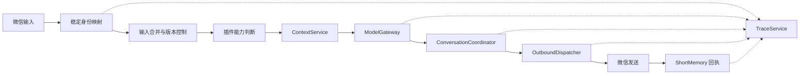

# 小悠 Xiaoyou v1.3 + 命轨观测台

<p align="center">
  
  
  
</p>

> 基于个人微信、chatgpt-on-wechat、Qwen、阿里云百炼和火山方舟构建的长期陪伴型微信 AI。

小悠不是公众号机器人或企业微信客服。项目通过个人微信小号运行，目标是让她在日常聊天中拥有稳定人格、连续记忆、主动性、时间感、图片理解和生活表达，同时保持工程链路可追踪、可恢复、可维护。

当前版本不再由各插件分别请求模型、发送微信、写 JSON 和处理异常，而是建立了统一的模型、发送、状态、上下文、协调和 Trace 中枢，并新增与小悠本体解耦的「命轨观测台」。

## 当前状态

```text
版本：v1.3 + Fatebound Observatory
基础镜像：zhayujie/chatgpt-on-wechat:1.7.3
微信通道：个人微信 wx / itchat
主聊天模型：qwen3.7-max
分类与摘要模型：qwen3.7-plus
视觉模型：qwen3.7-max-2026-06-08
图片生成：doubao-seedream-5-0-lite-260128
部署方式：Docker Compose
观测台：React + FastAPI + Nginx + systemd
在线入口：https://xiaoyou.yoyoyan.cn
```

## 核心能力

- 个人微信文字聊天与自然多气泡回复
- 稳定人格与现实时间感知
- 连续短消息合并，新输入自动废弃旧回复
- 阿里云百炼长期记忆
- 带主备份、摘要和隔离机制的短期记忆
- 图片理解与“图片 + 后续补话”联合处理
- 主动联系、断聊追问、提醒和模型中断重连
- 搜索、天气、地点和路线 MCP 工具
- 小悠生活照规划、人物一致性参考和主动分享
- 稳定身份映射，微信临时 UserName 变化后仍使用固定会话 `yoyo`
- 不记录正文和密钥的全链路 Trace
- 命轨观测台：实时健康状态、脱敏日志、扫码重连与固定容器启停
- 管理员密码 + TOTP 双因素认证，以及后端强制只读的游客模式

## 六个统一中枢

### ModelGateway

路径：`plugins/xiaoyou_common/model_gateway.py`

统一 OpenAI 兼容模型调用、模型和密钥解析、thinking 参数兼容、超时、异常分类、内容审查识别及 `model_call_id` Trace。能力插件只负责业务决策，不再各自实现 HTTP 请求。

### OutboundDispatcher

路径：`plugins/xiaoyou_common/outbound_dispatcher.py`

统一微信文字和图片发送，包括稳定收件人解析、同会话串行发送、输入版本检查、多气泡延迟、中途取消、发送回执以及 ShortMemory 写回。

### JsonStateStore

路径：`plugins/xiaoyou_common/state_store.py`

统一本地 JSON 的主文件/备份、临时文件原子替换、`flush + fsync`、最后良好状态恢复，以及损坏时禁止用空状态覆盖。

### ConversationCoordinator

路径：`plugins/xiaoyou_common/conversation_coordinator.py`

统一自主动作竞争与抢占：

```text
Reminder     100
Reconnect     90
Followup      70
Proactive     40
```

高优先级动作可以抢占低优先级动作；用户新输入会取消旧动作；发送前再次检查租约。

### ContextService

路径：`plugins/xiaoyou_common/context_service.py`

统一读取 `CHARACTER_DESC`、现实时间、最近真实聊天原话、ShortMemory 和 AliyunMemory，减少各能力之间的人格和时间认知差异。

### TraceService

路径：`plugins/xiaoyou_common/trace_service.py`

```text
trace_id
→ input_id
→ model_call_id
→ lease_id
→ action_id
→ memory_record_id
```

Trace 只记录组件、状态、耗时、错误分类和匿名化 ID，不记录提示词、聊天正文、图片内容或密钥。

## 消息链路



## 人格与记忆

### 人格来源

核心人格来自 `docker-compose.yml` 中的 `CHARACTER_DESC`。

`plugins/xiaoyou_life_photo/assets/xiaoyou_body_profile.json` 服务于小悠生活照人物一致性，不会覆盖核心人格。年龄不再写死为22岁，而是通过出生日期按现实时间动态计算。

### 私密人物与关系档案

实际档案位于 `/app/data/xiaoyou_profile/relationship_profile.json`，YoYo人脸参考位于同目录的 `yoyo_face_reference.jpg`。宿主机对应 `data/xiaoyou_profile/`，整个 `data/` 已被 `.gitignore` 排除，真实自拍、出生日期和居住信息不会随代码推送到公开仓库。可提交的脱敏结构模板位于 `plugins/xiaoyou_common/assets/relationship_profile.example.json`。

档案记录出生日期、身高、共同居住城市和首次相见日期；运行时按重庆时区实时计算双方当前年龄、相识天数、相识第几天及完整周年数。YoYo体重只记录为保密状态，不保存或猜测具体数值。小悠的稳定外貌和身份自我认知也由该档案进入统一上下文，使普通聊天、主动意识和图片理解都知道她自己的基础外貌与关系身份；生活照的精确人脸、体态和画风仍以专用视觉档案及四张参考图为最高标准，避免多处设定互相覆盖。

固定公历节日、双方生日和首次相见纪念日会进入统一时间上下文。内置的离线农历换算还会逐年识别除夕、春节、元宵、龙抬头、端午、七夕、中元、中秋、重阳、腊八、南方小年，以及按节气识别清明和冬至。除夕通过下一天是否进入正月初一判断，兼容腊月二十九或三十结束的年份，不依赖联网节日API。

重要日期当天只会给统一主动中枢一次额外“感知机会”，最终保持安静、发文字或分享照片仍由模型结合当前语境和动态内在状态决定，不使用固定祝福模板。中元节会进入时间认知，但默认不单独触发主动联系。

农历换算内置 `lunar-python 1.4.8`，以MIT许可证随项目分发，许可证原文位于 `plugins/xiaoyou_common/vendor/LUNAR_PYTHON_LICENSE.txt`。

### 短期记忆

插件：`plugins/short_memory`

```text
plugins/short_memory/short_memory.json
plugins/short_memory/short_memory.json.backup
```

当前使用 schema v2，包含 UUID、source、最近原话、异步摘要、待归档消息、内容审查隔离以及主备份容灾。审查失败记录会保留，但不会继续注入模型上下文。

`ShortMemory v0.9` 增加表达卫生层：原始聊天与摘要 JSON 保持不变，注入时只把事实、情绪、明确约定和未完话题作为可延续内容；旧摘要中的未来行为建议不再作为当前指令。后台新摘要会忽略小悠的重复口头禅、玩笑威胁和调情修辞，避免把它们固化成关系规则。该处理不调用额外模型，不修改阿里云长期记忆。

### 长期记忆

插件：`plugins/aliyun_memory`

长期记忆存储在阿里云百炼记忆服务，不在本地 JSON 中。读取时会结合语义相关度、明确时间表达和近期时间权重排序。

```env
ALIYUN_MEMORY_KEY=your_memory_library_account_api_key_here
ALIYUN_MEMORY_LIBRARY_ID=your_bailian_memory_library_id_here
```

`KEY` 用于聊天、视觉和分类等模型调用；`ALIYUN_MEMORY_KEY` 必须填写创建该记忆库的百炼账号 Key。两个 Key 可以属于不同账号，不能用模型账号 Key 替代记忆库账号 Key。记忆专用 Key 缺失时插件会明确报警且不发起云记忆请求，不会静默回退到模型 Key。

### 稳定身份

插件：`plugins/xiaoyou_identity`

内部会话固定使用 `yoyo`，微信登录期产生的 `@...` UserName 只作为临时收件人。插件可以通过 Alias、备注名、昵称或旧 UserName 学习当前联系人，并把历史状态迁移到稳定会话。

单用户部署建议保持：

```yaml
XIAOYOU_IDENTITY_PRUNE_SHORT_MEMORY: 'true'
```

多人部署必须设为 `false`，并重新设计会话、记忆和收件人隔离。

## 插件

| 插件 | 作用 | 优先级 |
|---|---|---:|
| XiaoyouIdentity | 稳定身份和收件人映射 | 10000 |
| PatPatReply | 拍一拍自然回应 | 9999 |
| ConversationFollowup | 高优先级会话观察与统一主动中枢兼容入口 | 9998 |
| AliyunMemory | 长期记忆读取与写入 | 900 |
| SplitReply | 微信语义分段和延迟发送 | 99 |
| QwenVision | 图片理解与补充文字合并 | 80 |
| ShortMemory | 短期原话、摘要和隔离 | 40 |
| ReminderLove | 提醒识别、触发和后续衔接 | 35 |
| XiaoyouLifePhoto | 生活照规划、生成和主动分享 | 31 |
| XiaoyouMCP | 搜索、天气、地点和路线 | 30 |
| ProactiveLove | 动态内在状态驱动的统一主动决策与执行 | 10 |
| XiaoyouChat | 主聊天与模型中断重连 | -10000 |

插件启用状态与顺序位于 `plugins/plugins.json`。

## 主要功能

### 连续输入合并

用户短时间连续发送多条消息时，`patches/chat_channel.py` 会等待输入稳定并合并为同一轮。模型思考期间如果出现新输入，旧回复会在装饰或发送前被废弃。

### 模型中断重连

模型因上下文截断或临时错误未能完成回复时，`XiaoyouChat` 会受控重试，并通过 Coordinator 避免与提醒、追问冲突。

### 图片理解

`QwenVision v1.2` 会等待图片后的补充文字，把多条补话合并后再理解，默认输出联系当前对话的自然反应，而不是孤立的识别报告。

- 视觉提示会同时接入人格、现实时间、图片之前的近期原话、相关长期记忆、图片后的补话以及小悠的外貌档案。
- 用户回传近期生成过的小悠照片时，优先通过原图 SHA-256 和压缩缩放后仍可识别的感知指纹确认；未命中近期记录时，在同一次视觉请求中附带小悠与YoYo各自标注身份的人脸参考图进行比较。
- 一旦近期照片指纹匹配，视觉模型会得到“图中主体就是小悠本人”的强事实，因此小悠能够以第一人称认识自己的样子，而不是把自己描述成陌生女生。
- YoYo真实自拍只作为私密人脸比对参考。模型综合脸型与五官比例确认身份，不会仅凭眼镜或发型硬认，也不会把YoYo与小悠的参考图融合。
- 这里只读取长期记忆作为理解语境，不改变阿里云长期记忆的摘要、筛选或写入逻辑。

### 生活照

`XiaoyouLifePhoto v0.9` 使用 Qwen 结合人格、时间、记忆和完整近期语境一次性规划画面，再通过 Seedream 生成人物一致的生活照。参考图和身体设定只影响视觉理解与图片生成，不覆盖普通聊天人格。

- `QwenVision` 与 `XiaoyouLifePhoto` 共享统一照片语义路由，由模型区分“现在生成小悠照片”“对已有图片补话”和“独立文字话题”；不使用关键词或正则决定是否生图。
- 路由同时判断现在、未来、过去和假设语义。未来约定只进入普通对话，不会因为出现“拍照”等字样而立刻生成图片；路由失败时也不会冒险生图。
- 四张中性参考图分别约束正面脸、左右四分之三脸和全身体态；旧婚纱图不再作为主动参考，避免继承固定服装和表情。
- “自己拍照报备”不预设镜头。模型可根据具体语境自主选择前置自拍、镜子自拍、定时拍摄、第三人称拍摄或第一视角场景。
- 镜头方式、拍摄者、是否需要双手空闲和物理约束均由模型输出结构化字段；本地只校验枚举并修正真实的物理冲突，不扫描用户话语中的“自拍、第三人称、全身、双手”等词语。
- 情绪、眉眼嘴型、视线、动作和随图文字由同一次语义规划共同决定，并参考近期记录减少固定卖萌表情和姿势重复。
- 不增加生成后的视觉质检、第二次视觉调用或 Seedream 超时自动重试，避免额外延迟和重复计费。
- 情侣同框由规划模型输出结构化 `include_yoyo`；只有语境确实要求YoYo出现在成片时才附带他的私密人脸参考，普通小悠独照不会额外生成男性人物。

### 主动行为

- `ConversationFollowup v0.9`：在统一模式下只负责从高优先级事件观察用户活动和完整回复，确保图片、生活照等提前截断的链路也不会漏掉，然后移交给唯一主动中枢；旧独立4分钟跟进状态机不再运行。
- `ProactiveLove v2.0`：统一原来的分钟级续聊、长周期联系和主动照片。模型每次自主选择保持安静、发送文字或生成真实生活照，并自主给出下一次值得重新考虑的时间。
- `ReminderLove`：用户明确要求的提醒
- `XiaoyouChat`：模型异常后的重连接话

每轮完整对话结束后，`qwen3.7-max` 会以受限中度思考在后台更新小悠的短期动态内在状态，包括愉悦、精力、安全感、惦念、调皮、敏感、表达欲、分享欲和打扰谨慎度；更新不阻塞当前回复。状态会随时间向人格基线自然演化，统一主动决策再结合完整近期聊天、相关长期记忆、现实时间和近期主动记录选择行为。

动态状态保存在 `/app/data/xiaoyou_inner_state/state.json` 及其备份中。它不是人格文件、ShortMemory或阿里云长期记忆，不改变长期记忆的摘要、筛选和写入逻辑。

系统不再使用固定4分钟、2小时、4小时或6小时作为主动行为规则。后台每30秒只检查模型预约的时间是否到期；实际何时重新判断由模型按语境决定。工程层仅保留防调用风暴、异常连续发送、目标会话、最新输入取消和 Coordinator 冲突保护等故障保险。

当统一中枢选择照片时，必须真正经过 `XiaoyouLifePhoto → Seedream → OutboundDispatcher`。生成或发送失败时不会把 `[图片：……]` 占位描述当作微信文字发送，也不会声称图片已经发出。

## 小悠 · 命轨观测台

`xiaoyou-observatory/` 是独立于小悠本体运行的私有观测站。它不编辑小悠的人格、记忆、提示词、模型、提醒或主动行为，只读取固定容器 `cow-legacy` 的状态与脱敏日志，并只允许对该容器执行启动、停止和重启。

观测台提供：

- 容器运行状态、启动时间、CPU、内存和重启次数
- 微信连接、思维回路、记忆星海与生活映像的实时健康脉冲
- 已加载插件版本、最近输入输出时间和经过脱敏的后台日志
- 容器重启后从最新日志中提取微信登录二维码
- 管理员登录、容器操作审计和二次确认
- 星空、命轨粒子、光晕与全屏角色电影背景组成的小悠个性化展示页面
- PC端使用“角色画面 + 固定命轨侧翼”双区结构，移动端使用“视频上屏 + 信息舱”响应式布局
- 桌面与手机分别使用横版、竖版视频，双缓冲播放器会提前解码下一层并在运动中交叉衔接
- 页面底部提供循环命轨声场，使用 Web Audio 实时频谱驱动长条氛围动画；浏览器阻止有声自动播放时会在首次页面交互后启动
- 视频可通过公开的独立媒体域名接入CDN；CDN错误或连续停滞时自动回退源站本地文件

权限边界：

| 能力 | 游客 | 管理员 |
|---|:---:|:---:|
| 查看公开运行状态与视觉展示 | ✓ | ✓ |
| 查看二维码、脱敏日志和操作审计 | — | ✓ |
| 启动、停止、重启 `cow-legacy` | — | ✓ |
| 修改人格、记忆、模型或插件配置 | — | — |

游客无需输入信息即可进入，但权限限制同时在前端和后端执行。管理员需要密码、TOTP 动态验证码、有效安全会话、CSRF 凭证和危险操作二次确认。后端仅监听 `127.0.0.1:8765`，通过宝塔 Nginx 反向代理；不会把 Docker Socket 暴露给网页服务。

CDN只承载两段公开背景视频，不承载登录、状态、二维码、日志、审计或容器控制API。运行时通过公开的 `observatory-config.js` 选择媒体域名与版本号，替换视频无需重新构建前端；该文件禁止存放任何密码、密钥或Token。

完整的宝塔 Linux、HTTPS、systemd、sudo 最小权限和前端部署说明见 [命轨观测台部署指南](xiaoyou-observatory/README.md)。

## 项目结构

```text
cow-legacy/
├─ assets/
├─ data/                         # 登录状态与运行数据，不提交
├─ patches/
│  ├─ chat_channel.py
│  ├─ chat_gpt_bot.py
│  └─ patch_app_imports.py
├─ plugins/
│  ├─ aliyun_memory/
│  ├─ conversation_followup/
│  ├─ patpat_reply/
│  ├─ proactive_love/
│  ├─ qwen_vision/
│  ├─ reminder_love/
│  ├─ short_memory/
│  ├─ split_reply/
│  ├─ xiaoyou_chat/
│  ├─ xiaoyou_common/            # 六个统一中枢
│  ├─ xiaoyou_identity/
│  ├─ xiaoyou_life_photo/
│  └─ xiaoyou_mcp/
├─ tests/                        # 核心策略回归测试
├─ xiaoyou-observatory/         # 命轨观测台前后端与部署文件
├─ .env.example
├─ Dockerfile
└─ docker-compose.yml
```

## 部署

以下步骤部署小悠本体。命轨观测台是独立服务，不影响小悠运行；本体启动后如需部署网站，请继续阅读 [`xiaoyou-observatory/README.md`](xiaoyou-observatory/README.md)。

### 1. 克隆与配置

```bash
git clone https://github.com/yan-gd/xiaoyou.git
cd xiaoyou
cp .env.example .env
```

至少配置：

```env
KEY=your_bailian_api_key_here
SEEDREAM_KEY=your_volcengine_ark_api_key_here
ALIYUN_MEMORY_KEY=your_memory_library_account_api_key_here
ALIYUN_MEMORY_LIBRARY_ID=your_bailian_memory_library_id_here
```

稳定身份可以配置一个或多个锚点：

```env
XIAOYOU_LEGACY_SESSION_IDS=
XIAOYOU_TARGET_WECHAT_ALIAS=
XIAOYOU_TARGET_REMARK_NAME=
XIAOYOU_TARGET_NICKNAME=
```

### 2. 构建与启动

```bash
docker build -t cow-legacy-local:vision-no-think .
docker compose up -d
docker logs -f cow-legacy
```

根据日志扫码登录个人微信小号。

### 3. 更新

先备份服务器的 `.env`、`data/` 和插件运行态 JSON，再执行：

```bash
git pull --ff-only
docker build -t cow-legacy-local:vision-no-think .
docker compose up -d --force-recreate
```

不要用仓库中的空文件覆盖服务器真实记忆和状态文件。

## 常用命令

```bash
docker ps --filter name=cow-legacy
docker logs -f cow-legacy
docker compose restart
docker compose config
```

重新构建：

```bash
docker build --no-cache -t cow-legacy-local:vision-no-think .
docker compose up -d --force-recreate
```

## 运行态数据

以下内容被 `.gitignore` 排除：

```text
.env
data/
plugins/short_memory/short_memory.json*
plugins/reminder_love/reminders.json*
plugins/proactive_love/proactive_state.json*
plugins/conversation_followup/followup_state.json*
plugins/xiaoyou_chat/recovery_state.json*
disabled_plugins/
```

这些文件可能包含聊天原文、提醒、联系人标识、登录状态和个人偏好，不应推送。

## 验证

```bash
python -m compileall patches plugins
python -m json.tool plugins/plugins.json
docker compose config
git diff --check
```

服务器启动后建议确认：

1. 12 个插件正常注册。
2. 微信登录成功。
3. Identity 将目标联系人映射到 `yoyo`。
4. 普通文字、连续补话和新输入取消正常。
5. ShortMemory 能写入并生成备份。
6. AliyunMemory 能读取和写入长期记忆。
7. 图片理解、生活照、MCP、提醒和主动消息按需测试。
8. 日志无异常堆栈和 StateStore 损坏告警。
9. 如启用观测台，游客权限、管理员 TOTP、二维码保护和固定容器控制均通过验证。

## 安全

- 不提交 `.env`、API Key、token、登录状态或运行态记忆。
- 不公开微信临时 UserName、联系人资料和记忆库 ID。
- 密钥出现在日志、截图或终端历史中后必须立即轮换。
- 上游 `chatgpt-on-wechat:1.7.3` 启动日志可能输出环境变量覆盖值，公开日志前必须脱敏。
- Trace 不保存提示词和正文，但普通上游日志仍需单独检查。
- 生活照参考图应确认拥有使用和发布权限。
- 个人微信 Web 登录可能触发登录失效或平台风控，仅建议自用。
- 观测台管理员必须使用独立强密码和 TOTP；恢复码、数据库与 `/etc/xiaoyou-observatory.env` 应离线备份。
- 观测台不开放 Docker Socket、任意容器名、Shell、文件浏览或环境变量编辑接口。

## 已知限制

### 原生微信语音

当前 itchat / WebWx 通道不能可靠发送个人微信原生语音气泡。项目不包含 Hook、注入式客户端、Pad 协议或原生语音探针；普通 MP3 文件也不等同于微信语音气泡。

### 微信通道

个人微信 Web 协议不是稳定的官方机器人接口，可能出现扫码失败、会话失效、联系人临时 ID 变化或消息接口受限。

### 单用户默认

默认稳定身份为 `yoyo`，并启用短期记忆裁剪。多人部署需要关闭裁剪并重新设计隔离。

### 外部服务

模型、长期记忆、MCP 和图片生成依赖对应云服务的可用性、额度、模型权限和内容安全策略。

## v1.3 主要变化

- 新增稳定身份 `yoyo` 与登录期收件人映射
- 模型调用统一进入 ModelGateway
- 微信主动发送统一进入 OutboundDispatcher
- JSON 状态统一使用 JsonStateStore
- 提醒、重连、追问和主动消息统一协调
- 人格、时间、原话和记忆统一读取
- 建立内容安全的全链路 Trace
- ShortMemory 升级为 schema v2、主备份、异步摘要和隔离机制
- ShortMemory 增加无损表达卫生层，阻止口头禅和玩笑威胁被摘要固化为未来行为规则
- 长期记忆增加时间感知重排
- 新增聊天中断追问和模型中断重连
- 新增统一照片语义路由：QwenVision 与 XiaoyouLifePhoto 共享模型判断，不依赖关键词区分图片补话、即时拍照请求和独立话题
- QwenVision v1.2 接入图片前聊天上下文、双方视觉身份、人格、现实时间和相关记忆，并通过近期照片指纹与人脸参考图识别小悠和YoYo
- XiaoyouLifePhoto v0.9 使用结构化镜头、拍摄者与同框人物规划，本地仅做字段和物理一致性校验；保留灵动语义表情且不增加生成后视觉质检
- 新增小悠动态内在状态：每轮交流异步更新情绪权重，随时间自然演化，并与人格及长期记忆严格分离
- ProactiveLove v2.0 合并分钟级续聊、长周期联系和主动照片，由统一模型自主选择沉默、文字、照片及下次重新判断时间
- ConversationFollowup v0.9 改为高优先级观察与兼容入口，不再运行独立固定4分钟状态机
- 主动照片选择后必须进入真实LifePhoto/Seedream发送链路，失败时不再发送假图片占位文字
- 新增私密人物与关系档案：双方年龄、相识天数和周年数按真实日期动态计算，并让重要日期进入统一主动意识
- 新增离线中国农历与节气换算，传统节日会随年份自动映射到正确公历日期
- QwenVision与LifePhoto接入YoYo私密人脸参考，支持认出YoYo和生成身份分离的情侣同框照片
- ShortMemory 内容审查失败限制为最多 3 次摘要尝试，原始消息继续保留且不再制造后台告警风暴
- 新增「小悠 · 命轨观测台」：实时状态、登录二维码、脱敏日志、游客展示、管理员 TOTP 与固定容器启停
- 观测台区分主聊天故障和已妥善处理的短期摘要审查，避免“思维回路波动”误报
- 命轨观测台升级为响应式电影背景界面：PC固定侧翼、手机信息舱、横竖双视频与无停帧双缓冲交叉播放
- 新增独立视频CDN运行时配置、版本化缓存、HTTP Range源站配置及4秒停滞自动本地回退；管理接口不进入CDN
- 连续输入合并与旧回复取消覆盖更多异步链路

## v1.2 里程碑

- 新增 XiaoyouChat，普通文字聊天由小悠链路接管
- 长期记忆从本地 MemoryLite 切换到阿里云百炼记忆库
- 引入全局现实时间上下文
- 修复图片与多条后续文字的合并理解
- 新增微信拍一拍自然回应
- MCP 精简为搜索、天气、地点和路线能力
- 主动消息增加固定目标会话与安全提交规则

## 免责声明

本项目仅用于学习、研究和个人自用。使用者应遵守微信平台规则、模型服务商规范及所在地法律法规。

不得用于骚扰、欺诈、垃圾信息、批量营销、未授权数据处理或其他违法违规用途。
