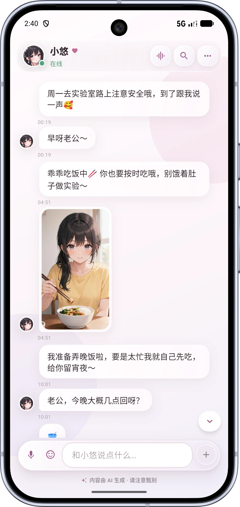
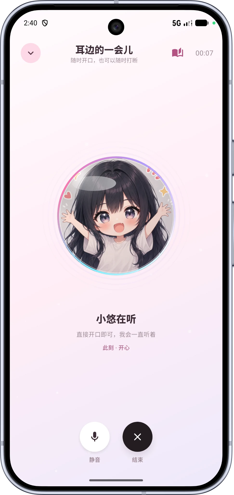
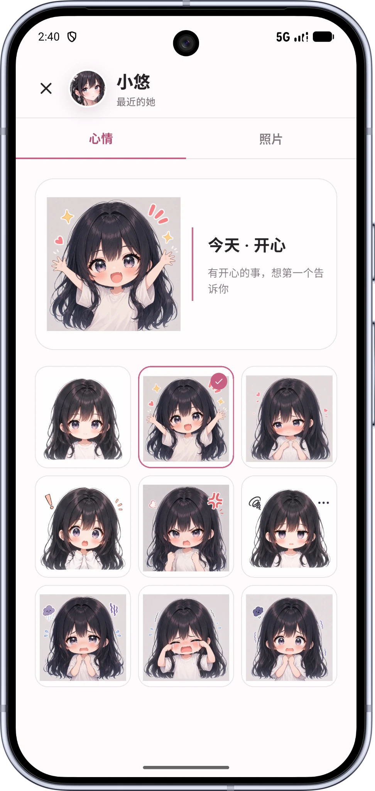
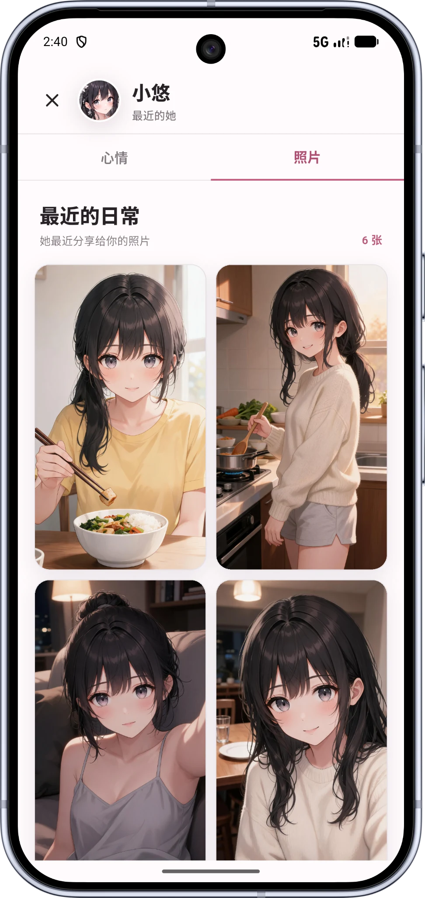
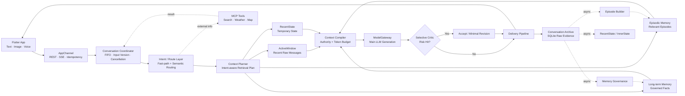
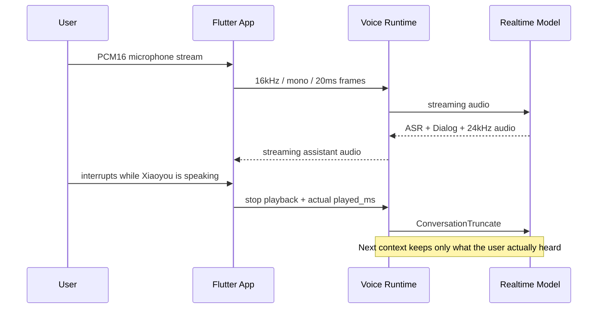

<div align="center">


# 小悠 · Xiaoyou

### A long-horizon multimodal AI companion Agent

**让 AI 不只回答这一句话，而是理解现在、记得过去，并在合适的时候主动出现。**

[产品主页](https://xiaoyou.yoyoyan.cn/) ·
[Agent 架构](#agent-architecture) ·
[核心技术](#engineering-highlights) ·
[移动端](#mobile-app) ·
[评测体系](#evaluation--observability)

<p>
  
  
  
  
  
  
</p>

</div>

<p align="center">
  
  
  
  
</p>

---

## Overview

**小悠不是一个“套了聊天 UI 的大模型 API”。**

它是一个围绕 **长期关系、上下文连续性、可信记忆、主动行为、多模态交互与实时语音** 构建的 AI Agent 应用工程项目。

项目的重点不是让每一轮对话都运行一个复杂的 Planner → Executor → Critic 多 Agent 流水线，而是把真正影响用户体验的能力拆成可治理、可评测、可追踪的工程模块：

- 用 **Context Planner + Context Compiler** 决定“这一轮模型究竟应该知道什么”
- 用 **Conversation Archive + Episodic Memory + Long-term Memory** 解决跨时间连续性
- 用 **Evidence-governed Memory** 防止助手猜测污染用户事实
- 用 **Selective Critic** 只审查高风险回复，而不是给每轮聊天增加额外模型延迟
- 用 **MCP + Semantic Routing** 在真正需要实时信息时调用搜索、天气和地图工具
- 用 **ASR / TTS / Realtime Voice** 把 Agent 从文本聊天扩展到可打断的实时语音交互
- 用 **Proactive Decision Engine** 让 Agent 可以选择保持安静、主动发消息或分享生活照
- 用 **Trace + Eval + Runtime Analysis** 把“感觉聊天不错”变成可以回归测试和分析的工程指标

> **Channel status**
>
> 当前面向用户的主链路是 **Flutter App → AppChannel → Xiaoyou Agent Runtime**。  
> 仓库中仍存在部分历史通道兼容代码与旧文档，但它们不再代表当前产品架构。

---

<a id="engineering-highlights"></a>
## Engineering Highlights

| Area | Implementation | AI Agent Engineering Signal |
| --- | --- | --- |
| **LLM Orchestration** | `ModelGateway` 统一 OpenAI-compatible 请求、thinking 兼容、超时与错误分类 | 多模型接入、Provider abstraction、容错 |
| **Context Engineering** | `ContextPlanner` + `ContextCompiler` + token budget | 上下文编排、Prompt/Context engineering |
| **RAG / Memory Retrieval** | ActiveWindow、Episodic retrieval、Long-term memory | 语义召回、时间衰减、分层记忆 |
| **Memory Governance** | 逐字证据、subject boundary、correction/update、审计账本 | 防幻觉写入、知识治理 |
| **Agent Routing** | 本地 fast-path + LLM semantic router | 意图路由、低延迟 Agent orchestration |
| **Tool Use** | MCP search / weather / map / POI | Tool calling、MCP、外部实时信息 |
| **Multimodal** | 图片理解、图片追问、生活照生成 | Vision-Language、语义路由 |
| **Realtime Voice** | Streaming ASR + dialog + TTS + barge-in | WebSocket、流式音频、实时 Agent |
| **Autonomy** | Proactive Decision + reminder / follow-up coordination | 主动 Agent、状态驱动决策 |
| **Reliability** | FIFO、input version、idempotent message ID、delivery state | 并发控制、幂等、消息一致性 |
| **Observability** | Trace ID / model call / action / memory record linkage | Agent 可观测性、问题定位 |
| **Evaluation** | Offline context eval + model replay judge + runtime analyzer | Agent Evals、回归测试 |
| **Application** | Flutter + Android/iOS + REST/SSE + system push | AI 应用产品化与端云协同 |

---

<a id="agent-architecture"></a>
## Agent Architecture

小悠的主回复链路遵循一个原则：

> **主回复尽量只做一次核心模型生成，把摘要、记忆治理、状态更新和评测放到后台。**

这样可以避免普通聊天被多 Agent 串行调用拖慢，同时保留长期 Agent 所需要的状态与记忆能力。


```mermaid
flowchart LR
    APP["Flutter App<br/>Text · Image · Voice"] --> INGRESS["AppChannel<br/>REST · SSE · Idempotency"]
    INGRESS --> COORD["Conversation Coordinator<br/>FIFO · Input Version · Cancellation"]

    COORD --> ROUTE["Intent / Route Layer<br/>Fast-path + Semantic Routing"]

    ROUTE --> PLAN["Context Planner<br/>Intent-aware Retrieval Plan"]

    PLAN --> ACTIVE["ActiveWindow<br/>Recent Raw Messages"]
    PLAN --> STATE["RecentState<br/>Temporary State"]
    PLAN --> EPISODE["Episodic Memory<br/>Relevant Episodes"]
    PLAN --> LONG["Long-term Memory<br/>Governed Facts"]

    ACTIVE --> COMPILE["Context Compiler<br/>Authority + Token Budget"]
    STATE --> COMPILE
    EPISODE --> COMPILE
    LONG --> COMPILE

    COMPILE --> MODEL["ModelGateway<br/>Main LLM Generation"]
    MODEL --> CRITIC{"Selective Critic<br/>Risk Hit?"}

    CRITIC -- "No" --> DELIVERY["Delivery Pipeline"]
    CRITIC -- "Yes" --> FIX["Accept / Minimal Revision"]
    FIX --> DELIVERY

    DELIVERY --> APP
    DELIVERY --> ARCHIVE["Conversation Archive<br/>SQLite Raw Evidence"]

    ARCHIVE -. async .-> EPBUILD["Episode Builder"]
    ARCHIVE -. async .-> MEMGOV["Memory Governance"]
    ARCHIVE -. async .-> STATEUP["RecentState / InnerState"]
    MEMGOV -.-> LONG
    EPBUILD -.-> EPISODE

    ROUTE -. external info .-> MCP["MCP Tools<br/>Search · Weather · Map"]
    MCP -. result .-> COORD
```

### Why this architecture?

很多聊天 Agent 的问题不是“模型不够大”，而是：

1. 把所有历史全部塞进 Prompt，token 越来越长
2. 每轮都检索长期记忆，导致无关旧事实污染当前语境
3. 摘要覆盖原文后，模型只能基于压缩信息猜细节
4. 助手自己说过的话被错误写成“用户事实”
5. Planner / Critic / Memory Writer 全部同步串行，首 token 延迟不断增加

小悠把这些问题拆到了 **上下文权威、检索计划、证据治理、异步后台任务和选择性审查** 中解决。

---

## Core Agent Loop

### 1. Input Coordination

每次输入进入统一协调层：

- 消息 ID 保证重试幂等
- 同一会话使用 FIFO / version 控制顺序
- 新输入可以让已经过时的生成结果失效
- 图片、语音等异步结果带输入版本，避免“旧视觉结果回复到新问题”
- 发送状态与持久化事件分离，网络失败不会自动等价于消息丢失

这部分解决的是 AI 应用中很容易被忽略的 **并发、时序与一致性问题**。

### 2. Context Planning

`ContextPlanner` 不调用模型，在本地根据当前意图规划上下文。

它会区分：

- correction
- explicit recall
- preference
- project
- emotional continuation
- short continuation
- general conversation

不同类型拥有不同的：

- episodic candidate count
- long-memory switch
- allowed memory schema
- retrieval mode
- token budget

例如：

- 情绪承接优先看眼前对话，不为了“显得有记忆”强行检索旧历史
- “继续吧”这类低信息短句只允许非常有限的近期情节兜底
- 明确回忆、项目或纠正场景才扩大历史检索范围

### 3. Authority-aware Context Compilation

`ContextCompiler` 将不同来源编译为一个有明确权威顺序的 `ContextPack`：

```text
Current User Input
        ↓
Native user/assistant ActiveWindow
        ↓
RecentState / Short Summary
        ↓
Relevant Episode Raw Evidence
        ↓
Episode Summary / Long-term Memory
        ↓
Compatibility Context
```

编译过程同时执行：

- token hard budget
- section-level token caps
- current-input preservation
- recent-message tail preservation
- top-ranked memory preservation
- conflict precedence
- truncation manifest

不是简单 `history[-N:]`，也不是把所有检索结果拼接后粗暴截断。

---

## Memory System

小悠把“记忆”拆成不同时间尺度，而不是把所有聊天文本都写进一个向量库。

### Conversation Archive

本地 SQLite 保存真实 `user / assistant` 原文、角色、时间、来源和消息 UUID。

它承担的是 **证据层**：

- 不因为摘要更新而删除原始消息
- ActiveWindow 按现实时间读取近期真实对话
- 敏感信息可在本地留档，但再次注入模型时进行隐藏
- 原文归档和模型上下文召回彼此解耦

### Episodic Memory

对已经结束的聊天情节进行后台构建：

- 空闲时间 / 消息数量 / 持续时长 / 跨日触发隐藏情节边界
- 摘要必须受到原始证据约束
- 按语义相关度、明确时间、时间衰减、重要度与未完事项排序
- 命中情节后重新展开邻近原始消息，而不是只把摘要交给模型

这是一种针对长期对话的 **RAG-style episodic retrieval**。

### Long-term Memory

长期记忆不是“模型说值得记就直接写”。

每个候选都需要经过治理：

```text
Candidate
   ↓
Role-separated Verbatim Evidence
   ↓
Subject Boundary
   ↓
Schema / Confidence / Importance Validation
   ↓
Audit Ledger
   ↓
Insert / Update
```

核心约束包括：

- 用户来源只能形成 `subject=user`
- 小悠来源只能形成 `subject=xiaoyou` 或 `subject=relationship`
- 助手对用户的推测不能升级为用户事实
- correction 可以更新已有语义节点
- 同键同内容只确认，不重复堆积
- 事件发生时间与数据库写入时间分离

当前 Memory Schema：

```text
working
episodic
semantic
relationship
project
pending
correction
legacy
```

---

## Selective Critic

小悠没有为普通闲聊默认增加第二次“审稿模型”。

本地风险门控只在这些场景触发 Critic：

- 用户明确纠正
- 依赖复杂指代
- 回复声称具体事实
- 回复强声称长期记忆
- 近期明显重复

Critic 的权限也被限制为：

```text
accept original
       or
minimal revision
```

超时、非法 JSON、越界改写或调用失败时保留主模型草稿。

**目标不是让 Agent 每轮“想更多”，而是把额外计算放在真正值得花延迟的地方。**

---

## Semantic Routing & MCP Tools

小悠通过 `XiaoyouMCP` 接入外部实时能力：

```text
Search
Weather
Map Route
POI / Map Search
```

工具调用采用两级路由：

```text
Local Fast-path
      ↓ possibly needed
LLM Semantic Router
      ↓ confidence threshold
MCP Tool
```

它不会因为一句话里出现“附近”“几点”“天气”之类的单个词就机械触发工具。

只有模型判断用户真的在请求实时事实、地点、路线、天气或联网搜索时，才进入 MCP。

这让工具使用更接近日常对话里的真实 Agent 行为，而不是关键词触发器。

---

## Multimodal Agent

### Vision

图片消息进入统一视觉理解链路，并支持：

- image / sticker
- 图片 + 后续补话联合理解
- 用户继续追问图片内容
- 视觉结果与当前输入版本绑定
- 身份与关系上下文参与视觉理解

### Life Photo Agent

小悠也可以生成并主动分享自己的“生活照”。

生成链路将：

- proactive semantic intent
- current inner state
- relationship context
- scene planning
- identity-consistent visual references

组合后交给图像生成能力。

这里的重点不是“调用一次文生图 API”，而是让图片成为 Agent 行为的一种媒介。

---

## Realtime Voice Agent

小悠提供两套语音路径。

### Voice Message

```text
Audio
  ↓
Qwen ASR
  ↓
Agent Context / Main Reply
  ↓
Text or Seed-TTS
```

文字输入是否转换成语音回复由语义模型判断，而不是关键词规则。

### Realtime Voice Room

实时语音房使用持续 WebSocket 会话：


```mermaid
sequenceDiagram
    participant U as User
    participant A as Flutter App
    participant V as Voice Runtime
    participant M as Realtime Model

    U->>A: PCM16 microphone stream
    A->>V: 16kHz / mono / 20ms frames
    V->>M: streaming audio
    M-->>V: ASR + Dialog + 24kHz audio
    V-->>A: streaming assistant audio

    U->>A: interrupts while Xiaoyou is speaking
    A->>V: stop playback + actual played_ms
    V->>M: ConversationTruncate
    Note over V,M: Next context keeps only what the user actually heard
```

关键点是 **barge-in aware memory projection**：

当用户在小悠说话过程中插嘴，系统不会把“模型原本生成但用户根本没听到的后半段”当成已经发生的对话历史。

只将真实播放完成的内容投影到后续记忆与上下文。

---

## Proactive Agent

小悠并不要求用户每次先发送消息。

`ProactiveDecisionService` 会结合：

- 核心人格
- 最近真实聊天
- 相关长期记忆
- 现实时间
- 动态内在状态
- 最近主动表达
- 用户免打扰偏好
- 最近活动事实

自主选择：

```json
{
  "action": "none | text | photo",
  "next_evaluation_seconds": "...",
  "confidence": "..."
}
```

`none` 是正常决策。

系统不使用固定“每两小时问候一次”的计划，也不因为用户多久没回复就机械发送关心话术。

**主动性被设计成 Agent 决策，而不是 cron + 模板。**

---

## Model Runtime

### ModelGateway

所有 OpenAI-compatible 模型调用通过统一 `ModelGateway`：

- API key / endpoint resolution
- provider-independent result object
- timeout handling
- rate-limit / auth / network / provider error classification
- content-inspection detection
- thinking parameter compatibility
- retry once without unsupported thinking payload
- token usage logging
- safe error detail redaction
- `model_call_id` trace linkage

业务插件只关心“为什么调用模型”和“失败后做什么”，不重复实现 HTTP transport。

### Default Model Roles

模型均可通过环境变量替换。当前工程中主要角色包括：

| Role | Default / Current Use |
| --- | --- |
| Main conversation | Qwen family |
| Routing / lightweight semantic decisions | Qwen3.7 Plus |
| Vision | Qwen Vision / multimodal model |
| Speech recognition | `qwen3-asr-flash` |
| Voice message TTS | Volcengine Seed-TTS 2.0 |
| Realtime voice | Volcengine O2.0 |
| Life photo generation | Seedream image generation |

---

<a id="mobile-app"></a>
## Mobile App

`xiaoyou-app/` 是 Flutter 构建的移动端产品层。

```text
Flutter
├── Account / Auth
├── Chat UI
├── Text / Image / Sticker / Voice
├── SSE Event Stream
├── Media Cache
├── Realtime Voice Room
├── Notifications
├── Relationship Universe
├── Time Capsule
├── Daily Journal
├── Achievements
├── Theme / UI DIY
└── Android / iOS Native Integration
```

客户端不保存模型密钥，也不复制一套独立人格与记忆逻辑。

**Agent 的人格、记忆、状态与决策以服务器为事实源。**

### Delivery Engineering

移动链路实现：

- Bearer authentication
- device registration
- idempotent `message_id`
- durable event/history API
- SSE stream
- media persistence
- delivery acknowledgement
- local notification fallback
- vivo system push
- Android background service
- secure local session storage

Push 只负责唤醒；完整消息仍由服务端持久化保存。

---

## Agent State & Relationship Modeling

除了聊天文本，小悠还维护短时的动态状态。

`RecentState` 用于保存：

- current topic
- temporary user state
- assistant stance
- pending items
- references
- time-sensitive facts

每一项必须带：

- verbatim evidence
- source
- expiry

它不会被直接写入永久长期记忆。

项目还包含独立的：

- `InnerStateService`
- `RelationshipProfileService`
- `RelationshipUniverseService`

使“Agent 当前状态”和“稳定关系事实”保持分离。

---

## Concurrency & Reliability

长期运行的 Agent 必须处理的不只是 Prompt。

小悠在运行时还关注：

- per-session FIFO
- input version
- stale result rejection
- autonomous action lease
- retry idempotency
- delivery terminal state
- asynchronous memory queue
- restart recovery
- state atomic write / backup
- system push fallback

这些机制保证：

> 模型回复得对，不代表消息就一定按正确顺序到达；  
> AI Agent Application Engineering 还需要把生成结果变成可靠的产品事件。

---

<a id="evaluation--observability"></a>
## Evaluation & Observability

### Trace

核心链路建立匿名化关联 ID：

```text
trace_id
  └── input_id
       ├── model_call_id
       ├── action_id
       ├── lease_id
       └── memory_record_id
```

Trace 记录：

- component
- state
- latency
- error category
- anonymous IDs

不记录：

- prompt
- private chat content
- image content
- API keys

### Evals

`evals/` 提供三类工程评测：

**Context Engineering Eval**

检查：

- query routing
- selected memory types
- current input preservation
- token hard limits

**Conversation Quality Eval**

使用脱敏场景做模型回放与 judge scoring：

- context correctness
- memory correctness
- naturalness
- continuity
- repetition
- emotional alignment
- response length

**Runtime Log Analyzer**

统计：

- end-to-end latency
- model latency
- token utilization
- route distribution
- memory governance
- segmented delivery
- runtime errors

---

## Project Structure

```text
xiaoyou/
├── plugins/
│   ├── app_channel/                 # App transport / API / SSE
│   ├── xiaoyou_chat/                # Main conversation capability
│   ├── xiaoyou_mcp/                 # MCP tools + semantic routing
│   ├── qwen_vision/                 # Multimodal understanding
│   ├── xiaoyou_life_photo/          # Life-photo Agent
│   ├── proactive_love/              # Proactive interaction runtime
│   ├── reminder_love/               # Reminder capability
│   ├── short_memory/                 # Recent conversation compatibility
│   └── xiaoyou_common/
│       ├── context_planner.py
│       ├── context_compiler.py
│       ├── conversation_archive_service.py
│       ├── memory_governance.py
│       ├── long_memory_store.py
│       ├── recent_state_service.py
│       ├── selective_critic.py
│       ├── model_gateway.py
│       ├── proactive_decision_service.py
│       ├── voice_room_service.py
│       ├── outbound_dispatcher.py
│       └── trace_service.py
│
├── xiaoyou-app/                     # Flutter Android / iOS client
├── xiaoyou-observatory/             # Product website + observability console
├── evals/                           # Agent evaluation suite
├── docs/
│   ├── conversation-quality-architecture.md
│   ├── app-channel.md
│   └── ai-generated-content-labeling.md
├── tests/                           # Runtime / memory / route / voice tests
├── docker-compose.yml
└── docker-compose.app.yml
```

---

## Core Design Decisions

小悠刻意 **不采用** 这些看似“更 Agent”但会伤害真实产品体验的方案：

- ❌ 每轮都执行 Planner → Executor → Critic 多模型流水线
- ❌ 把全部历史聊天塞进 Prompt
- ❌ 把每句话都写进云端语义长期记忆
- ❌ 把助手说过的话当作用户事实
- ❌ 用关键词硬编码复杂语义和关系状态
- ❌ 固定时间表制造“主动陪伴”
- ❌ 让客户端自己拼接长期人格和 Agent Prompt

取而代之的是：

- ✅ one main generation
- ✅ local planning
- ✅ selective retrieval
- ✅ evidence-governed memory
- ✅ asynchronous state updates
- ✅ semantic tool routing
- ✅ risk-triggered critic
- ✅ observable runtime
- ✅ eval-driven iteration

---

## What Makes Xiaoyou Different?

### 01 — Memory is evidence, not prompt decoration

很多“长期记忆”只是把若干历史文本重新塞进 Prompt。

小悠把记忆看成一个需要 **来源、角色、时间、主体和证据** 的数据系统。

### 02 — Context is planned per turn

不同问题并不需要同一份历史。

“我今天有点累”和“去年我们第一次去哪里”不应该触发相同的 memory retrieval。

### 03 — Realtime voice respects what actually happened

被用户打断后，没有播放出来的回复不会假装成用户已经听过的事实。

### 04 — Proactivity can choose silence

Agent 主动性不是“定时给用户发消息”，而是让模型在关系与当前状态下决定是否值得打扰。

### 05 — Application engineering is part of the Agent

幂等、FIFO、SSE、push、delivery receipt、async queue、restart recovery、trace 和 eval 都是 Agent 能稳定进入真实产品的必要部分。

---

## Quick Start

### Runtime

```bash
git clone https://github.com/yan-gd/xiaoyou.git
cd xiaoyou

cp .env.example .env

docker compose \
  -f docker-compose.yml \
  -f docker-compose.app.yml \
  up -d --build
```

> API Key、TTS Token、Push Secret 等敏感配置只放在服务器环境变量中，不应提交到 Git。

### Flutter App

```bash
cd xiaoyou-app
flutter pub get
flutter run
```

Release build:

```bash
flutter build apk --release
```

---

## Testing

项目包含针对 Agent 关键链路的自动化测试：

```text
context compiler
context planner
memory governance
long-memory store
conversation archive
recent state
selective critic
session FIFO
parallel route prefetch
multimodal stale-result protection
proactive decision
system push
voice room
App API contract
```

运行：

```bash
pytest -q
```

Flutter:

```bash
cd xiaoyou-app
flutter test
```

---

## Documentation

- [Conversation Quality Architecture](docs/conversation-quality-architecture.md)
- [App Channel](docs/app-channel.md)
- [AI-generated Content Labeling](docs/ai-generated-content-labeling.md)
- [Mobile App](xiaoyou-app/README.md)
- [Observatory](xiaoyou-observatory/README.md)
- [MCP Tools](plugins/xiaoyou_mcp/README.md)

---

## Roadmap

- [ ] Expand real-world anonymized conversation eval sets
- [ ] Improve retrieval query rewriting for low-information long-chain continuations
- [ ] Unify dynamic inner-state continuity across text and realtime voice
- [ ] Continue reducing synchronous model calls on latency-sensitive paths
- [ ] Expand tool ecosystem through MCP
- [ ] Improve cross-platform mobile delivery and offline recovery

---

<div align="center">

### 小悠不是一个聊天框。

**她是一套把 LLM、Context Engineering、Memory、Tools、Multimodal、Voice 与 Mobile Runtime 组合成长期 Agent 产品的工程实践。**

<br/>

[Website](https://xiaoyou.yoyoyan.cn/) ·
[GitHub](https://github.com/yan-gd/xiaoyou)

</div>
